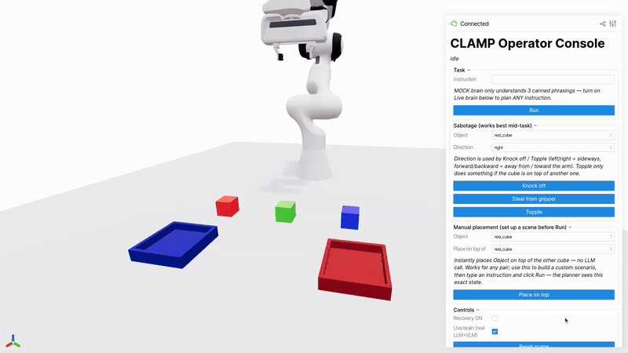
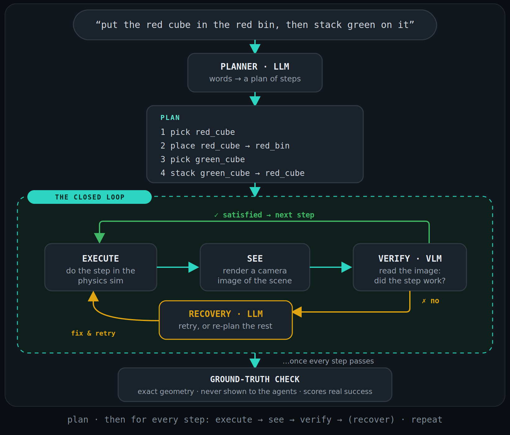
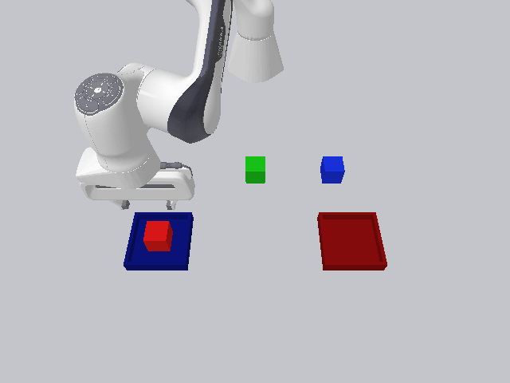
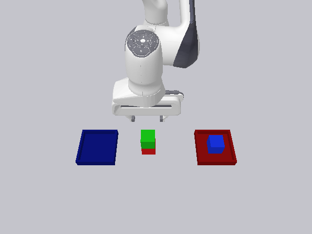
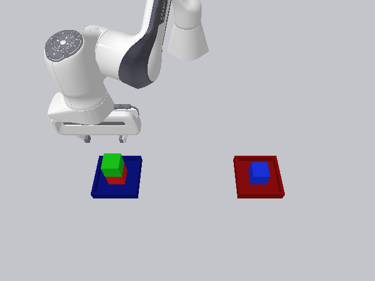

<div align="center">

# 🤖 CLAMP Console

### A robot planner that notices when things go wrong, and fixes them.


*You type a plain-English instruction → an **LLM plans it** → a simulated arm **does it** →*
*a **vision model checks each step from a camera image** → a second **LLM re-plans and recovers.***
*Drive the whole thing live in your browser.*



<sub>A real session (sped up): a task runs, a cube is <b>knocked out of its bin mid-task</b> with a sabotage click, and the loop <b>re-plans and fixes it → success</b>.</sub>

</div>

---

## 🧩 The problem: making a plan is easy, surviving reality is hard

Robots (and LLM "agents" in general) are good at producing a plan. The trouble is the world doesn't cooperate: a grasp slips, a cube lands beside the bin, something gets knocked over. A system that just runs its plan top-to-bottom and hopes (**open-loop**) never notices, and reaches the goal only about **38%** of the time under randomly injected failures.

> **The question CLAMP answers:** how do you make an LLM-driven robot *robust to failure*, so it
> **perceives** that the world diverged from the plan and **corrects course on its own**?

## 🧠 The solution: close the loop with three agents

The plan is wrapped in a feedback loop run by three models and one piece of ordinary, deterministic
control code. Each does exactly one job:

| | Agent | Its one job |
|:--:|---|---|
| 🟢 | **Planner** &middot; LLM | Turns *"put the red cube in the red bin, then stack green on it"* into an ordered list of concrete steps (`pick` / `place` / `stack` / `put_down`), validated against the scene. |
| 🔵 | **Verifier** &middot; VLM | After each step, reads a **rendered camera image** and answers one question: *did that work?* It sees only the picture, like a person glancing at the table, never the true coordinates. |
| 🟠 | **Recovery** &middot; LLM | When the verifier says *no*, decides whether to **retry** the step or **re-plan** the rest from where things actually are now. |
| ⚙️ | **Controller** &middot; code | Not a model. It runs each step, calls the verifier, applies the recovery decision, and loops until the goal truly holds. |

## 🔁 How the loop works

<div align="center">
  
</div>

**Read it in one breath.** For every step: *execute* it → *see* it (a camera image) → *verify* it.
Passed? Move on. Failed? *Recover* (retry or re-plan) and try again. Once every step checks out, a final **ground-truth geometry check** (kept hidden from the agents) scores real success, so a confident-but-wrong agent can't grade its own homework.

The idea that makes it work: **verification is perceptual**. It's judged from an *image*, the way a human would glance at the table, so the system catches failures it was never told to look for. And because the whole goal is re-checked at the end, a sabotage at **any** moment gets caught and fixed.

<div align="center">
  
  
  
  <br/>
  <sub><b>Exactly what the verifier sees:</b> real camera frames from the recorded session above (a rendered photo, not the clean 3D view). Every frame the VLM judges is saved to <code>results/console_frames/</code>.</sub>
</div>

## 📈 The result

<div align="center">

| Under the same injected failures | Task success |
|---|:--:|
| Recovery **off** (open-loop) | `38%` |
| Recovery **on** (closed loop) | **`97%`** &nbsp; 🔺 **+58%** |

</div>

Recovery is what turns a brittle demo into something that behaves like it's *actually paying attention*, and the console lets you watch it happen, and cause it, yourself.

<sub>The simulation is deliberately simple: a Franka Panda, colored cubes, and shallow-walled trays, with "magic-grasp" skills (pure state transitions, no trajectory planning), so the focus stays on the agent loop rather than manipulation control.</sub>

---

## ▶️ Run it

```bash
uv venv -p 3.11 .venv
source .venv/bin/activate
uv pip install -r requirements.txt
python3 -m console.app
```

Real LLM + VLM brain by default (a session costs a few cents, shown in a running cost meter); it falls back automatically to an offline **MOCK mode** if no `OPENROUTER_API_KEY` is set. Models live in `config.yaml` (cheap OpenRouter models, all < $1/M tokens). Built on [Viser](https://github.com/nerfstudio-project/viser).

## 🎮 What you can do in the console

- **Type any instruction** like *"put the red cube in the red bin, then stack the green cube on it"* and click **Run**. A real LLM plans it.
- **Watch it live in 3D.** The arm reaches, picks, places; each step animates so you can follow it.
- **Sabotage mid-task** 🔴🟢🔵. *Knock off* a cube, *steal* it from the gripper, or *topple* a stack, and watch the verifier catch it and recovery fix it, live.
- **Manual placement.** Build any scenario *before* you Run, so the planner sees exactly that state.
- **See the reasoning.** The verifier's and recovery agent's own words stream into an event feed, and the exact frames the VLM judges are saved to `results/console_frames/`.
- **Toggles + meter.** Recovery ON/OFF, Live/Mock brain, Reset, and a running LLM call/cost meter.

## 🧪 Tests

```bash
.venv/bin/python -m pytest -q         # offline / mock, no API key needed (~7s)
```

Covers the schema, scene + skills + ground-truth predicates, the planner + validation, the closed loop with recovery, and the console driver (sabotage / manual-placement / episode logic).

## 🗂️ Repository layout

```
console/  the operator console: scene3d (Viser 3D mirror), driver (episode loop + sabotage), app (GUI)
agents/   schema (Pydantic), llm_client (OpenRouter + mock + usage meter), planner, verifier, recovery
env/      scene, magic-grasp skills, render, ground-truth state, observation helpers
loop/     controller, the closed loop (precondition gate → execute → verify → recover)
prompts/  planner / verifier / recovery prompt templates (diffable, not buried in code)
docs/     USER_GUIDE, the full console walkthrough
```

<div align="center"><sub>Full walkthrough → <a href="docs/USER_GUIDE.md"><code>docs/USER_GUIDE.md</code></a> &nbsp;·&nbsp; Simulation only: validated in simulation, no hardware implied.</sub></div>
